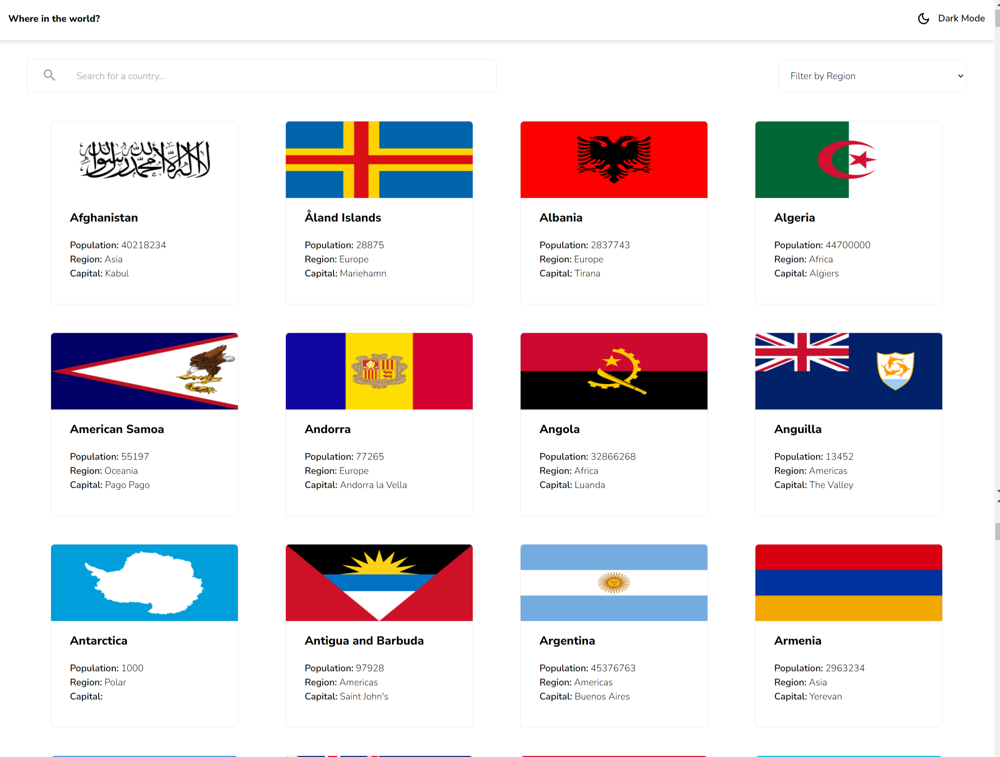
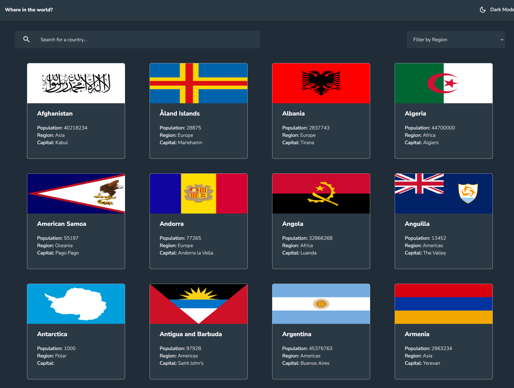

# Frontend Mentor - REST Countries API with color theme switcher solution

This is a solution to the [REST Countries API with color theme switcher challenge on Frontend Mentor](https://www.frontendmentor.io/challenges/rest-countries-api-with-color-theme-switcher-5cacc469fec04111f7b848ca). Frontend Mentor challenges help you improve your coding skills by building realistic projects.

## Table of contents

- [Overview](#overview)
  - [The challenge](#the-challenge)
  - [Screenshot](#screenshot)
  - [Links](#links)
- [My process](#my-process)
  - [Built with](#built-with)
  - [What I learned](#what-i-learned)
  - [Continued development](#continued-development)
  - [Useful resources](#useful-resources)
- [Author](#author)

## Overview

### The challenge

Users should be able to:

- See all countries from the API on the homepage
- Search for a country using an `input` field
- Filter countries by region
- Click on a country to see more detailed information on a separate page
- Click through to the border countries on the detail page
- Toggle the color scheme between light and dark mode _(optional)_

### Screenshot

### Links

- Solution URL: [Github](https://github.com/DrPlain/frontend-rest-coutries-api)
- Live Site URL: [Live site ](https://countries-made-easy.netlify.app/)

### Built with

- Semantic HTML5 markup
- Mobile-first workflow
- [React](https://reactjs.org/) - JS library
- [Tailwindcss](https://tailwindcss.com/) - For styles

### What I learned

I learnt how to manage complex react states and how to share states from parent component down to children components. Also, I practiced alot of condition rendering

## Author

- Website - [Obiasor Gideon](https://drplain-portfolio.netlify.app/)
- Frontend Mentor - [@DrPlain](https://www.frontendmentor.io/profile/DrPlain)
- Twitter - [@obiasor](https://www.twitter.com/obiasor)
